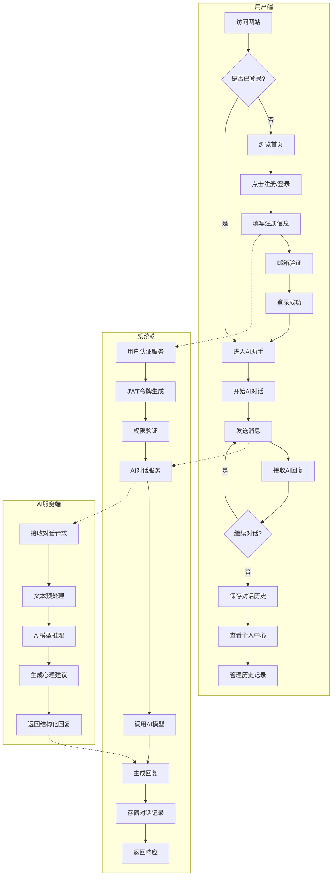
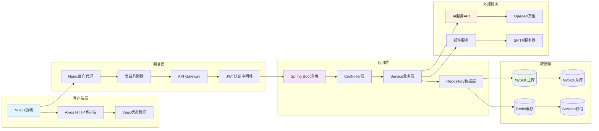
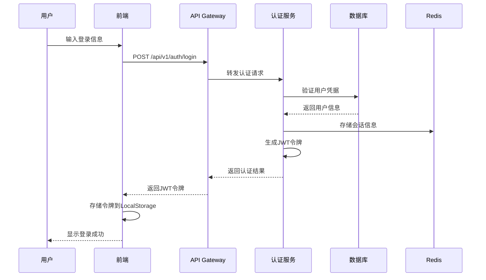
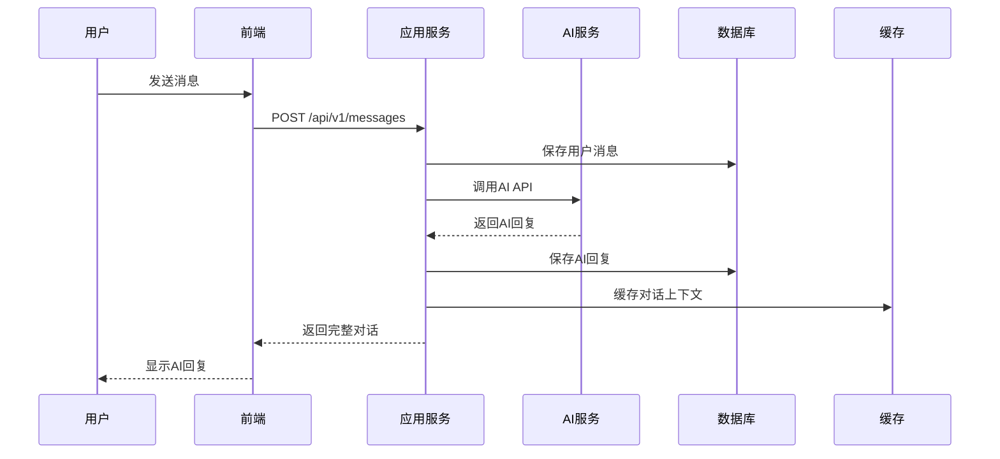

# XLHealth AI心理咨询系统 - 解决方案架构需求文档

## 文档信息
- **项目名称**：XLHealth AI心理咨询系统
- **文档版本**：v1.0
- **编写日期**：2024-01-15
- **编写人员**：解决方案架构师
- **审核状态**：待审核

---

## 一、业务需求

### 1.1 核心业务流程（泳道图）



### 1.2 功能清单（按模块树形呈现）

```
📁 XLHealth AI心理咨询系统
├── 🔐 用户认证模块
│   ├── ✅ 用户注册
│   │   ├── 邮箱验证
│   │   ├── 密码强度校验
│   │   └── 用户名唯一性检查
│   ├── ✅ 用户登录
│   │   ├── 多方式登录（用户名/邮箱）
│   │   ├── JWT令牌管理
│   │   └── 登录状态保持
│   └── ✅ 用户登出
│       ├── 令牌失效处理
│       └── 会话清理
├── 🏠 首页展示模块
│   ├── ✅ 欢迎横幅
│   │   ├── 主文案展示
│   │   └── 引导按钮
│   ├── ✅ 动态消息区
│   │   ├── 公告列表
│   │   └── 发布日期显示
│   └── ✅ 服务简介
│       ├── 24小时在线说明
│       ├── 隐私保护承诺
│       └── 对话存档功能
├── 🤖 AI心理助手模块
│   ├── ✅ 对话管理
│   │   ├── 新建对话
│   │   ├── 历史对话加载
│   │   └── 对话删除
│   ├── ✅ 实时聊天
│   │   ├── 消息发送
│   │   ├── AI回复生成
│   │   ├── 消息气泡显示
│   │   └── 输入框交互
│   └── ❓ AI集成
│       ├── 第三方API调用
│       ├── 心理咨询专业回复
│       └── 情感分析处理
├── 👤 个人中心模块
│   ├── ✅ 用户信息管理
│   │   ├── 基本信息展示
│   │   ├── 头像占位显示
│   │   └── 账号信息查看
│   ├── ✅ 历史记录管理
│   │   ├── 对话历史查看
│   │   ├── 单条记录删除
│   │   └── 批量数据清除
│   └── ✅ 账号设置
│       ├── 密码修改
│       └── 安全设置
└── 🔧 系统管理模块
    ├── ❓ 配置管理
    │   ├── AI模型配置
    │   ├── 系统参数设置
    │   └── 功能开关控制
    ├── ❓ 审计日志
    │   ├── 用户操作记录
    │   ├── 系统事件追踪
    │   └── 安全事件监控
    └── ❓ 数据备份
        ├── 定期备份策略
        ├── 数据恢复机制
        └── 灾难恢复预案
```

---

## 二、非功能性需求

### 2.1 性能需求

| 指标类型 | 具体要求 | 测试条件 | 备注 |
|----------|----------|----------|---------|
| **并发用户数** | ≥500 | 同时在线用户 | 初期目标，可扩展至2000+ |
| **响应时间** | ≤200ms | API接口平均响应 | 不包含AI推理时间 |
| **AI响应时间** | ≤3000ms | AI对话生成 | 第三方API调用时间 |
| **页面加载时间** | ≤2000ms | 首屏完全加载 | 包含静态资源 |
| **数据库查询** | ≤100ms | 单次查询平均时间 | 复杂查询≤500ms |
| **吞吐量** | ≥1000 QPS | 系统整体处理能力 | 峰值可达2000 QPS |

### 2.2 安全性需求（OWASP TOP 10防护）

| OWASP风险 | 防护措施 | 实施状态 | 技术方案 |
|-----------|----------|----------|-----------|
| **A01:访问控制失效** | ✅ JWT认证 + 权限验证 | 已规划 | Spring Security + 自定义权限注解 |
| **A02:加密失效** | ✅ 密码BCrypt加密 + HTTPS | 已规划 | BCrypt + TLS 1.3 |
| **A03:注入攻击** | ✅ 参数化查询 + 输入验证 | 已规划 | MyBatis + Hibernate Validator |
| **A04:不安全设计** | ✅ 安全架构设计 + 威胁建模 | 已规划 | 最小权限原则 + 纵深防御 |
| **A05:安全配置错误** | ❓ 配置审计 + 默认配置加固 | 待定 | 自动化配置检查 |
| **A06:易受攻击组件** | ❓ 依赖扫描 + 版本管理 | 待定 | OWASP Dependency Check |
| **A07:身份认证失效** | ✅ 多因素认证 + 会话管理 | 已规划 | JWT + Redis会话存储 |
| **A08:软件数据完整性失效** | ❓ 代码签名 + 完整性校验 | 待定 | 数字签名验证 |
| **A09:安全日志监控失效** | ✅ 审计日志 + 异常监控 | 已规划 | ELK Stack + 告警机制 |
| **A10:服务端请求伪造** | ✅ URL白名单 + 请求验证 | 已规划 | 请求来源验证 |

### 2.3 兼容性需求

#### 2.3.1 浏览器支持矩阵

| 浏览器 | 版本要求 | 支持状态 | 市场占有率 | 测试优先级 |
|--------|----------|----------|------------|------------|
| **Chrome** | ≥90 | ✅ 完全支持 | 65% | 🔴 高 |
| **Firefox** | ≥88 | ✅ 完全支持 | 15% | 🟡 中 |
| **Safari** | ≥14 | ✅ 完全支持 | 12% | 🟡 中 |
| **Edge** | ≥90 | ✅ 完全支持 | 5% | 🟢 低 |
| **IE** | 不支持 | ❌ 不支持 | 1% | - |
| **移动端Chrome** | ≥90 | ✅ 完全支持 | 60% | 🔴 高 |
| **移动端Safari** | ≥14 | ✅ 完全支持 | 25% | 🟡 中 |

#### 2.3.2 操作系统支持矩阵

| 操作系统 | 版本要求 | 支持状态 | 备注 |
|----------|----------|----------|---------|
| **Windows** | 10/11 | ✅ 完全支持 | 主要目标平台 |
| **macOS** | ≥10.15 | ✅ 完全支持 | 开发者友好 |
| **Linux** | Ubuntu 18.04+ | ✅ 完全支持 | 服务器部署 |
| **Android** | ≥8.0 | ✅ 响应式支持 | 移动端适配 |
| **iOS** | ≥13.0 | ✅ 响应式支持 | 移动端适配 |

#### 2.3.3 设备分辨率支持

| 设备类型 | 分辨率范围 | 支持状态 | 设计断点 |
|----------|------------|----------|-----------|
| **桌面端** | 1920×1080+ | ✅ 完全支持 | ≥1200px |
| **笔记本** | 1366×768+ | ✅ 完全支持 | 992-1199px |
| **平板** | 768×1024+ | ✅ 响应式支持 | 768-991px |
| **手机** | 375×667+ | ✅ 响应式支持 | <768px |

---

## 三、数据流分析

### 3.1 系统整体数据流



### 3.2 核心业务数据流

#### 3.2.1 用户认证数据流



#### 3.2.2 AI对话数据流



### 3.3 数据存储策略

| 数据类型 | 存储方式 | 访问频率 | 一致性要求 | 备份策略 |
|----------|----------|----------|------------|----------|
| **用户基础信息** | MySQL主库 | 中等 | 强一致性 | 每日全量+实时增量 |
| **对话历史** | MySQL主库 | 高 | 最终一致性 | 每日全量+实时增量 |
| **会话状态** | Redis | 极高 | 弱一致性 | 主从复制 |
| **系统配置** | MySQL主库 | 低 | 强一致性 | 每日全量 |
| **审计日志** | MySQL主库 | 低 | 强一致性 | 每周归档 |
| **静态资源** | CDN+OSS | 中等 | 弱一致性 | 多地域备份 |

---

## 四、依赖项说明

### 4.1 技术栈依赖

#### 4.1.1 前端技术栈

| 技术组件 | 版本要求 | 状态 | 用途说明 | 风险评估 |
|----------|----------|------|----------|-----------|
| **Vue.js** | 3.3+ | ✅ 已确认 | 前端框架 | 🟢 低风险 |
| **Vue Router** | 4.2+ | ✅ 已确认 | 路由管理 | 🟢 低风险 |
| **Vuex** | 4.0+ | ✅ 已确认 | 状态管理 | 🟢 低风险 |
| **Element Plus** | 2.4+ | ✅ 已确认 | UI组件库 | 🟢 低风险 |
| **Axios** | 1.6+ | ✅ 已确认 | HTTP客户端 | 🟢 低风险 |
| **Node.js** | 18+ | ✅ 已确认 | 开发环境 | 🟢 低风险 |
| **npm/yarn** | 最新 | ✅ 已确认 | 包管理器 | 🟢 低风险 |

#### 4.1.2 后端技术栈

| 技术组件 | 版本要求 | 状态 | 用途说明 | 风险评估 |
|----------|----------|------|----------|-----------|
| **Java** | 17+ | ✅ 已确认 | 开发语言 | 🟢 低风险 |
| **Spring Boot** | 3.2+ | ✅ 已确认 | 应用框架 | 🟢 低风险 |
| **Spring Security** | 6.2+ | ✅ 已确认 | 安全框架 | 🟢 低风险 |
| **MyBatis Plus** | 3.5+ | ✅ 已确认 | ORM框架 | 🟢 低风险 |
| **MySQL** | 8.0+ | ✅ 已确认 | 关系数据库 | 🟢 低风险 |
| **Redis** | 7.0+ | ✅ 已确认 | 缓存数据库 | 🟢 低风险 |
| **Maven** | 3.9+ | ✅ 已确认 | 构建工具 | 🟢 低风险 |

### 4.2 外部服务依赖

#### 4.2.1 AI服务依赖

| 服务提供商 | 服务类型 | 状态 | 成本预估 | 风险评估 |
|------------|----------|------|----------|-----------|
| **OpenAI** | GPT-3.5/4 API | ❓ 待确认 | $0.002/1K tokens | 🟡 中风险 |
| **百度文心** | 文心一言API | ❓ 待确认 | ¥0.012/1K tokens | 🟡 中风险 |
| **阿里通义** | 通义千问API | ❓ 待确认 | ¥0.008/1K tokens | 🟡 中风险 |
| **自建模型** | 本地部署 | ❓ 待评估 | 硬件+运维成本 | 🔴 高风险 |

#### 4.2.2 基础设施依赖

| 服务类型 | 提供商 | 状态 | 成本预估 | 风险评估 |
|----------|--------|------|----------|-----------|
| **云服务器** | 阿里云/腾讯云 | ❓ 待确认 | ¥500-2000/月 | 🟢 低风险 |
| **数据库** | 云数据库RDS | ❓ 待确认 | ¥300-1000/月 | 🟢 低风险 |
| **缓存服务** | 云Redis | ❓ 待确认 | ¥100-500/月 | 🟢 低风险 |
| **CDN服务** | 阿里云CDN | ❓ 待确认 | ¥50-200/月 | 🟢 低风险 |
| **域名SSL** | 证书服务 | ❓ 待确认 | ¥100-500/年 | 🟢 低风险 |
| **邮件服务** | 企业邮箱 | ❓ 待确认 | ¥50-200/月 | 🟢 低风险 |

### 4.3 开发工具依赖

#### 4.3.1 开发环境

| 工具类型 | 推荐工具 | 状态 | 必要性 | 备注 |
|----------|----------|------|--------|---------|
| **IDE** | IntelliJ IDEA | ✅ 已确认 | 必需 | 后端开发 |
| **IDE** | VS Code | ✅ 已确认 | 必需 | 前端开发 |
| **数据库工具** | Navicat/DBeaver | ✅ 已确认 | 推荐 | 数据库管理 |
| **API测试** | Postman/Apifox | ✅ 已确认 | 必需 | 接口测试 |
| **版本控制** | Git | ✅ 已确认 | 必需 | 代码管理 |
| **容器化** | Docker | ❓ 待确认 | 推荐 | 部署环境 |

#### 4.3.2 CI/CD工具链

| 工具类型 | 推荐工具 | 状态 | 必要性 | 备注 |
|----------|----------|------|--------|---------|
| **代码仓库** | GitHub/GitLab | ❓ 待确认 | 必需 | 代码托管 |
| **CI/CD** | GitHub Actions | ❓ 待确认 | 推荐 | 自动化部署 |
| **镜像仓库** | Docker Hub | ❓ 待确认 | 可选 | 容器镜像 |
| **监控告警** | Prometheus | ❓ 待评估 | 可选 | 系统监控 |
| **日志分析** | ELK Stack | ❓ 待评估 | 可选 | 日志管理 |

### 4.4 合规性依赖

#### 4.4.1 法律法规要求

| 合规项目 | 要求等级 | 状态 | 影响范围 | 处理方案 |
|----------|----------|------|----------|-----------|
| **网络安全法** | 强制 | ❓ 待确认 | 数据安全 | 数据加密+访问控制 |
| **个人信息保护法** | 强制 | ❓ 待确认 | 用户隐私 | 隐私政策+用户授权 |
| **数据安全法** | 强制 | ❓ 待确认 | 数据处理 | 数据分类+安全措施 |
| **医疗器械监管** | 可选 | ❓ 待评估 | AI诊断 | 免责声明+专业建议 |
| **ICP备案** | 强制 | ❓ 待确认 | 网站运营 | 域名备案 |

#### 4.4.2 行业标准要求

| 标准类型 | 标准名称 | 状态 | 必要性 | 备注 |
|----------|----------|------|--------|---------|
| **信息安全** | ISO 27001 | ❓ 待评估 | 推荐 | 信息安全管理 |
| **质量管理** | ISO 9001 | ❓ 待评估 | 可选 | 质量体系认证 |
| **隐私保护** | GDPR合规 | ❓ 待评估 | 可选 | 国际化需求 |
| **无障碍访问** | WCAG 2.1 | ❓ 待评估 | 推荐 | 用户体验优化 |

---

## 五、风险评估与缓解策略

### 5.1 技术风险

| 风险类型 | 风险等级 | 影响程度 | 缓解策略 | 负责人 |
|----------|----------|----------|----------|---------|
| **AI服务不稳定** | 🟡 中 | 业务中断 | 多服务商备选+本地缓存 | 架构师 |
| **数据库性能瓶颈** | 🟡 中 | 响应延迟 | 读写分离+索引优化 | DBA |
| **第三方依赖风险** | 🟢 低 | 功能受限 | 版本锁定+定期更新 | 开发团队 |
| **安全漏洞风险** | 🔴 高 | 数据泄露 | 安全审计+渗透测试 | 安全团队 |

### 5.2 业务风险

| 风险类型 | 风险等级 | 影响程度 | 缓解策略 | 负责人 |
|----------|----------|----------|----------|---------|
| **合规性风险** | 🔴 高 | 法律风险 | 法务咨询+合规审查 | 法务团队 |
| **用户隐私风险** | 🔴 高 | 信任危机 | 隐私保护+透明政策 | 产品团队 |
| **AI回复质量** | 🟡 中 | 用户体验 | 内容审核+人工干预 | 运营团队 |
| **服务可用性** | 🟡 中 | 用户流失 | 高可用架构+监控告警 | 运维团队 |

---

## 六、实施计划与里程碑

### 6.1 开发阶段规划

| 阶段 | 时间周期 | 主要目标 | 交付物 | 验收标准 |
|------|----------|----------|--------|-----------|
| **Phase 1** | 2周 | 基础架构搭建 | 项目骨架+数据库 | 环境可用 |
| **Phase 2** | 3周 | 核心功能开发 | 用户系统+AI对话 | 功能完整 |
| **Phase 3** | 2周 | 界面优化 | 前端页面+交互 | 用户体验 |
| **Phase 4** | 1周 | 测试部署 | 测试报告+生产环境 | 质量达标 |

### 6.2 关键里程碑

- ✅ **M1**: 需求文档完成 (已完成)
- ❓ **M2**: 技术选型确认 (进行中)
- ❓ **M3**: 数据库设计完成 (待开始)
- ❓ **M4**: API接口设计完成 (待开始)
- ❓ **M5**: 核心功能开发完成 (待开始)
- ❓ **M6**: 系统测试完成 (待开始)
- ❓ **M7**: 生产环境部署 (待开始)

---

## 七、附录

### 7.1 术语表

| 术语 | 英文 | 定义 |
|------|------|------|
| **AI** | Artificial Intelligence | 人工智能，指模拟人类智能的计算机系统 |
| **JWT** | JSON Web Token | 基于JSON的开放标准令牌格式 |
| **API** | Application Programming Interface | 应用程序编程接口 |
| **SPA** | Single Page Application | 单页面应用程序 |
| **ORM** | Object-Relational Mapping | 对象关系映射 |
| **CDN** | Content Delivery Network | 内容分发网络 |

### 7.2 参考文档

- [XLHealth 产品需求文档](./xuqu.md)
- [XLHealth 数据库设计文档](./database-design.md)
- [XLHealth API接口规范](./api-specification.yaml)
- [前端开发任务清单](./frontend-tasks.md)

### 7.3 联系信息

- **项目经理**：待定
- **技术负责人**：待定
- **产品负责人**：待定
- **开发团队**：待定

---

**文档状态**：✅ 初稿完成 | ❓ 待审核 | 📝 持续更新

**最后更新**：2024-01-15

**下次审核**：2024-01-20