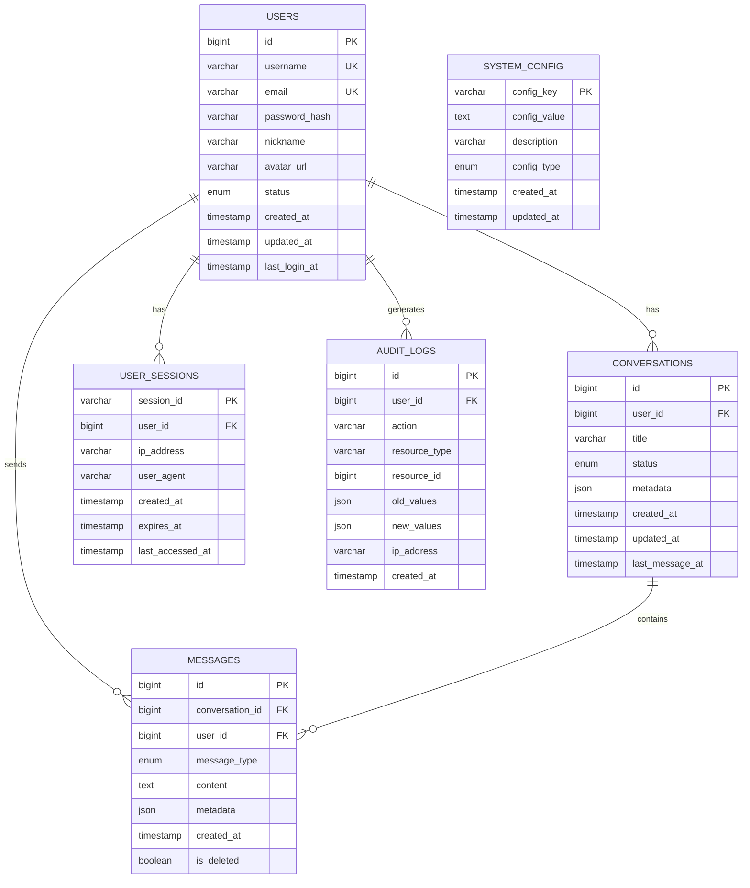

# XLHealth 数据库设计文档

## 1. 文档概述

### 1.1 设计目标

- 为 XLHealth AI 心理咨询系统提供稳定、高效的数据存储方案
- 支持用户认证、AI 对话、历史记录管理等核心业务功能
- 确保数据安全性、完整性和高可用性
- 支持系统横向扩展和性能优化

### 1.2 适用范围

- XLHealth 后端开发团队
- 数据库管理员（DBA）
- 系统运维人员
- 产品和测试团队

### 1.3 读者对象

- **主要读者**：后端开发工程师、数据库设计师
- **次要读者**：项目经理、测试工程师、运维工程师
- **技术要求**：熟悉 MySQL 8.0、SQL 语言、数据库设计原理

### 1.4 技术规范

- **数据库版本**：MySQL 8.0+
- **字符集**：utf8mb4
- **排序规则**：utf8mb4_unicode_ci
- **存储引擎**：InnoDB
- **时区**：Asia/Shanghai

---

## 2. 实体关系图 (ERD)



---

## 3. 数据字典

### 3.1 ⭐ 用户表 (users)

| 字段名        | 类型         | 约束               | 默认值                      | 描述                  | 示例                   |
| ------------- | ------------ | ------------------ | --------------------------- | --------------------- | ---------------------- |
| id            | BIGINT       | PK, AUTO_INCREMENT | -                           | 用户唯一标识          | 1001                   |
| username      | VARCHAR(50)  | UNIQUE, NOT NULL   | -                           | 🔒 用户名（登录用）   | user001                |
| email         | VARCHAR(100) | UNIQUE, NOT NULL   | -                           | 🔒 邮箱地址           | user@example.com       |
| password_hash | VARCHAR(255) | NOT NULL           | -                           | 🔒 密码哈希值(BCrypt) | $2a$10$...             |
| nickname      | VARCHAR(50)  | NOT NULL           | -                           | 用户昵称（显示用）    | 小明                   |
| avatar_url    | VARCHAR(500) | NULL               | NULL                        | 头像 URL              | /avatars/user001.jpg   |
| status        | ENUM         | NOT NULL           | 'ACTIVE'                    | 账户状态              | ACTIVE/INACTIVE/BANNED |
| created_at    | TIMESTAMP    | NOT NULL           | CURRENT_TIMESTAMP           | 创建时间              | 2024-01-01 10:00:00    |
| updated_at    | TIMESTAMP    | NOT NULL           | CURRENT_TIMESTAMP ON UPDATE | 更新时间              | 2024-01-01 10:00:00    |
| last_login_at | TIMESTAMP    | NULL               | NULL                        | 最后登录时间          | 2024-01-01 10:00:00    |

### 3.2 ⭐ 对话表 (conversations)

| 字段名          | 类型         | 约束                | 默认值                      | 描述         | 示例                    |
| --------------- | ------------ | ------------------- | --------------------------- | ------------ | ----------------------- |
| id              | BIGINT       | PK, AUTO_INCREMENT  | -                           | 对话唯一标识 | 2001                    |
| user_id         | BIGINT       | FK, NOT NULL, INDEX | -                           | 用户 ID      | 1001                    |
| title           | VARCHAR(200) | NOT NULL            | -                           | 对话标题     | 关于焦虑的咨询          |
| status          | ENUM         | NOT NULL            | 'ACTIVE'                    | 对话状态     | ACTIVE/ARCHIVED/DELETED |
| metadata        | JSON         | NULL                | NULL                        | 扩展信息     | {"tags":["anxiety"]}    |
| created_at      | TIMESTAMP    | NOT NULL            | CURRENT_TIMESTAMP           | 创建时间     | 2024-01-01 10:00:00     |
| updated_at      | TIMESTAMP    | NOT NULL            | CURRENT_TIMESTAMP ON UPDATE | 更新时间     | 2024-01-01 10:00:00     |
| last_message_at | TIMESTAMP    | NULL                | NULL                        | 最后消息时间 | 2024-01-01 10:30:00     |

### 3.3 ⭐ 消息表 (messages)

| 字段名          | 类型      | 约束                | 默认值            | 描述          | 示例                     |
| --------------- | --------- | ------------------- | ----------------- | ------------- | ------------------------ |
| id              | BIGINT    | PK, AUTO_INCREMENT  | -                 | 消息唯一标识  | 3001                     |
| conversation_id | BIGINT    | FK, NOT NULL, INDEX | -                 | 对话 ID       | 2001                     |
| user_id         | BIGINT    | FK, NOT NULL, INDEX | -                 | 发送者用户 ID | 1001                     |
| message_type    | ENUM      | NOT NULL            | -                 | 消息类型      | USER/AI/SYSTEM           |
| content         | TEXT      | NOT NULL            | -                 | 🔒 消息内容   | 我最近感到很焦虑...      |
| metadata        | JSON      | NULL                | NULL              | 消息元数据    | {"sentiment":"negative"} |
| created_at      | TIMESTAMP | NOT NULL            | CURRENT_TIMESTAMP | 创建时间      | 2024-01-01 10:00:00      |
| is_deleted      | BOOLEAN   | NOT NULL            | FALSE             | 是否已删除    | FALSE                    |

### 3.4 用户会话表 (user_sessions)

| 字段名           | 类型         | 约束                | 默认值            | 描述                     | 示例                |
| ---------------- | ------------ | ------------------- | ----------------- | ------------------------ | ------------------- |
| session_id       | VARCHAR(128) | PK                  | -                 | 🔒 会话 ID(JWT Token ID) | jwt_abc123...       |
| user_id          | BIGINT       | FK, NOT NULL, INDEX | -                 | 用户 ID                  | 1001                |
| ip_address       | VARCHAR(45)  | NOT NULL            | -                 | 🔒 IP 地址               | 192.168.1.100       |
| user_agent       | VARCHAR(500) | NULL                | NULL              | 🔒 用户代理              | Mozilla/5.0...      |
| created_at       | TIMESTAMP    | NOT NULL            | CURRENT_TIMESTAMP | 创建时间                 | 2024-01-01 10:00:00 |
| expires_at       | TIMESTAMP    | NOT NULL            | -                 | 过期时间                 | 2024-01-02 10:00:00 |
| last_accessed_at | TIMESTAMP    | NOT NULL            | CURRENT_TIMESTAMP | 最后访问时间             | 2024-01-01 10:00:00 |

### 3.5 系统配置表 (system_config)

| 字段名       | 类型         | 约束     | 默认值                      | 描述     | 示例                       |
| ------------ | ------------ | -------- | --------------------------- | -------- | -------------------------- |
| config_key   | VARCHAR(100) | PK       | -                           | 配置键名 | ai.model.name              |
| config_value | TEXT         | NOT NULL | -                           | 配置值   | gpt-3.5-turbo              |
| description  | VARCHAR(500) | NULL     | NULL                        | 配置描述 | AI 模型名称配置            |
| config_type  | ENUM         | NOT NULL | 'STRING'                    | 配置类型 | STRING/NUMBER/BOOLEAN/JSON |
| created_at   | TIMESTAMP    | NOT NULL | CURRENT_TIMESTAMP           | 创建时间 | 2024-01-01 10:00:00        |
| updated_at   | TIMESTAMP    | NOT NULL | CURRENT_TIMESTAMP ON UPDATE | 更新时间 | 2024-01-01 10:00:00        |

### 3.6 审计日志表 (audit_logs)

| 字段名        | 类型        | 约束               | 默认值            | 描述         | 示例                      |
| ------------- | ----------- | ------------------ | ----------------- | ------------ | ------------------------- |
| id            | BIGINT      | PK, AUTO_INCREMENT | -                 | 日志唯一标识 | 4001                      |
| user_id       | BIGINT      | FK, NULL, INDEX    | -                 | 操作用户 ID  | 1001                      |
| action        | VARCHAR(50) | NOT NULL           | -                 | 操作类型     | CREATE/UPDATE/DELETE      |
| resource_type | VARCHAR(50) | NOT NULL           | -                 | 资源类型     | USER/CONVERSATION/MESSAGE |
| resource_id   | BIGINT      | NULL               | NULL              | 资源 ID      | 2001                      |
| old_values    | JSON        | NULL               | NULL              | 🔒 修改前值  | {"status":"ACTIVE"}       |
| new_values    | JSON        | NULL               | NULL              | 🔒 修改后值  | {"status":"ARCHIVED"}     |
| ip_address    | VARCHAR(45) | NOT NULL           | -                 | 🔒 操作 IP   | 192.168.1.100             |
| created_at    | TIMESTAMP   | NOT NULL           | CURRENT_TIMESTAMP | 操作时间     | 2024-01-01 10:00:00       |

---

## 4. 索引设计

### 4.1 主键索引 (自动创建)

- `users.id`
- `conversations.id`
- `messages.id`
- `audit_logs.id`
- `system_config.config_key`
- `user_sessions.session_id`

### 4.2 唯一索引

```sql
-- 用户表唯一索引
CREATE UNIQUE INDEX uk_users_username ON users(username);
CREATE UNIQUE INDEX uk_users_email ON users(email);
```

### 4.3 业务索引

```sql
-- 对话表索引
CREATE INDEX idx_conversations_user_id ON conversations(user_id);
CREATE INDEX idx_conversations_status ON conversations(status);
CREATE INDEX idx_conversations_created_at ON conversations(created_at);
CREATE INDEX idx_conversations_last_message_at ON conversations(last_message_at);

-- 消息表索引
CREATE INDEX idx_messages_conversation_id ON messages(conversation_id);
CREATE INDEX idx_messages_user_id ON messages(user_id);
CREATE INDEX idx_messages_created_at ON messages(created_at);
CREATE INDEX idx_messages_type ON messages(message_type);
CREATE INDEX idx_messages_conversation_created ON messages(conversation_id, created_at);

-- 会话表索引
CREATE INDEX idx_sessions_user_id ON user_sessions(user_id);
CREATE INDEX idx_sessions_expires_at ON user_sessions(expires_at);

-- 审计日志索引
CREATE INDEX idx_audit_user_id ON audit_logs(user_id);
CREATE INDEX idx_audit_resource ON audit_logs(resource_type, resource_id);
CREATE INDEX idx_audit_created_at ON audit_logs(created_at);
CREATE INDEX idx_audit_action ON audit_logs(action);
```

### 4.4 索引创建原因

| 索引名                            | 创建原因         | 查询场景                 |
| --------------------------------- | ---------------- | ------------------------ |
| idx_conversations_user_id         | 用户对话列表查询 | 获取用户所有对话         |
| idx_messages_conversation_id      | 对话消息查询     | 加载对话历史消息         |
| idx_messages_conversation_created | 复合索引优化     | 按对话 ID 和时间排序查询 |
| idx_sessions_expires_at           | 会话清理         | 定期清理过期会话         |
| idx_audit_created_at              | 日志查询         | 按时间范围查询操作日志   |

---

## 5. 性能优化

### 5.1 分表策略

#### 5.1.1 消息表分表 (messages)

```sql
-- 按月分表策略
CREATE TABLE messages_202401 LIKE messages;
CREATE TABLE messages_202402 LIKE messages;
-- ... 继续创建月表

-- 分表路由规则
-- 根据 created_at 字段按月路由到对应分表
```

#### 5.1.2 审计日志分表 (audit_logs)

```sql
-- 按季度分表策略
CREATE TABLE audit_logs_2024q1 LIKE audit_logs;
CREATE TABLE audit_logs_2024q2 LIKE audit_logs;
-- ... 继续创建季度表
```

### 5.2 读写分离方案

#### 5.2.1 主从架构

- **主库 (Master)**：处理所有写操作 (INSERT, UPDATE, DELETE)
- **从库 (Slave)**：处理读操作 (SELECT)
- **同步方式**：MySQL 主从复制 (binlog)

#### 5.2.2 读写路由策略

```yaml
# 应用层配置
datasource:
  master:
    url: jdbc:mysql://master-db:3306/xlhealth
    operations: [INSERT, UPDATE, DELETE]
  slave:
    url: jdbc:mysql://slave-db:3306/xlhealth
    operations: [SELECT]
```

### 5.3 缓存机制

#### 5.3.1 Redis 缓存策略

```yaml
# 缓存配置
cache:
  user_info:
    key_pattern: "user:info:{user_id}"
    ttl: 3600 # 1小时

  conversation_list:
    key_pattern: "user:conversations:{user_id}"
    ttl: 1800 # 30分钟

  system_config:
    key_pattern: "system:config:{config_key}"
    ttl: 86400 # 24小时
```

#### 5.3.2 缓存更新策略

- **用户信息**：写入时更新缓存 (Write-Through)
- **对话列表**：定时刷新 + 手动失效
- **系统配置**：手动更新时清除缓存

### 5.4 查询优化

#### 5.4.1 分页查询优化

```sql
-- 避免 OFFSET 大数值的性能问题
-- 使用游标分页
SELECT * FROM conversations
WHERE user_id = ? AND id < ?
ORDER BY id DESC
LIMIT 20;
```

#### 5.4.2 统计查询优化

```sql
-- 使用汇总表存储统计数据
CREATE TABLE user_statistics (
    user_id BIGINT PRIMARY KEY,
    total_conversations INT DEFAULT 0,
    total_messages INT DEFAULT 0,
    last_active_at TIMESTAMP,
    updated_at TIMESTAMP DEFAULT CURRENT_TIMESTAMP ON UPDATE CURRENT_TIMESTAMP
);
```

---

## 6. 变更记录

### 版本 1.0.0 (2024-01-01)

**初始版本**

```sql
-- 创建数据库
CREATE DATABASE xlhealth
CHARACTER SET utf8mb4
COLLATE utf8mb4_unicode_ci;

USE xlhealth;

-- 创建用户表
CREATE TABLE users (
    id BIGINT PRIMARY KEY AUTO_INCREMENT,
    username VARCHAR(50) UNIQUE NOT NULL,
    email VARCHAR(100) UNIQUE NOT NULL,
    password_hash VARCHAR(255) NOT NULL,
    nickname VARCHAR(50) NOT NULL,
    avatar_url VARCHAR(500) NULL,
    status ENUM('ACTIVE', 'INACTIVE', 'BANNED') NOT NULL DEFAULT 'ACTIVE',
    created_at TIMESTAMP NOT NULL DEFAULT CURRENT_TIMESTAMP,
    updated_at TIMESTAMP NOT NULL DEFAULT CURRENT_TIMESTAMP ON UPDATE CURRENT_TIMESTAMP,
    last_login_at TIMESTAMP NULL
) ENGINE=InnoDB;

-- 创建对话表
CREATE TABLE conversations (
    id BIGINT PRIMARY KEY AUTO_INCREMENT,
    user_id BIGINT NOT NULL,
    title VARCHAR(200) NOT NULL,
    status ENUM('ACTIVE', 'ARCHIVED', 'DELETED') NOT NULL DEFAULT 'ACTIVE',
    metadata JSON NULL,
    created_at TIMESTAMP NOT NULL DEFAULT CURRENT_TIMESTAMP,
    updated_at TIMESTAMP NOT NULL DEFAULT CURRENT_TIMESTAMP ON UPDATE CURRENT_TIMESTAMP,
    last_message_at TIMESTAMP NULL,
    FOREIGN KEY (user_id) REFERENCES users(id) ON DELETE CASCADE
) ENGINE=InnoDB;

-- 创建消息表
CREATE TABLE messages (
    id BIGINT PRIMARY KEY AUTO_INCREMENT,
    conversation_id BIGINT NOT NULL,
    user_id BIGINT NOT NULL,
    message_type ENUM('USER', 'AI', 'SYSTEM') NOT NULL,
    content TEXT NOT NULL,
    metadata JSON NULL,
    created_at TIMESTAMP NOT NULL DEFAULT CURRENT_TIMESTAMP,
    is_deleted BOOLEAN NOT NULL DEFAULT FALSE,
    FOREIGN KEY (conversation_id) REFERENCES conversations(id) ON DELETE CASCADE,
    FOREIGN KEY (user_id) REFERENCES users(id) ON DELETE CASCADE
) ENGINE=InnoDB;

-- 创建会话表
CREATE TABLE user_sessions (
    session_id VARCHAR(128) PRIMARY KEY,
    user_id BIGINT NOT NULL,
    ip_address VARCHAR(45) NOT NULL,
    user_agent VARCHAR(500) NULL,
    created_at TIMESTAMP NOT NULL DEFAULT CURRENT_TIMESTAMP,
    expires_at TIMESTAMP NOT NULL,
    last_accessed_at TIMESTAMP NOT NULL DEFAULT CURRENT_TIMESTAMP,
    FOREIGN KEY (user_id) REFERENCES users(id) ON DELETE CASCADE
) ENGINE=InnoDB;

-- 创建系统配置表
CREATE TABLE system_config (
    config_key VARCHAR(100) PRIMARY KEY,
    config_value TEXT NOT NULL,
    description VARCHAR(500) NULL,
    config_type ENUM('STRING', 'NUMBER', 'BOOLEAN', 'JSON') NOT NULL DEFAULT 'STRING',
    created_at TIMESTAMP NOT NULL DEFAULT CURRENT_TIMESTAMP,
    updated_at TIMESTAMP NOT NULL DEFAULT CURRENT_TIMESTAMP ON UPDATE CURRENT_TIMESTAMP
) ENGINE=InnoDB;

-- 创建审计日志表
CREATE TABLE audit_logs (
    id BIGINT PRIMARY KEY AUTO_INCREMENT,
    user_id BIGINT NULL,
    action VARCHAR(50) NOT NULL,
    resource_type VARCHAR(50) NOT NULL,
    resource_id BIGINT NULL,
    old_values JSON NULL,
    new_values JSON NULL,
    ip_address VARCHAR(45) NOT NULL,
    created_at TIMESTAMP NOT NULL DEFAULT CURRENT_TIMESTAMP,
    FOREIGN KEY (user_id) REFERENCES users(id) ON DELETE SET NULL
) ENGINE=InnoDB;
```

### 版本 1.1.0 (计划中)

**功能增强**

- 添加用户标签系统
- 增加消息情感分析字段
- 优化索引结构

### 版本 1.2.0 (计划中)

**性能优化**

- 实施消息表分表策略
- 添加缓存层支持
- 实现读写分离

---

## 7. 附录

### 7.1 数据库连接配置

```yaml
# application.yml
spring:
  datasource:
    url: jdbc:mysql://localhost:3306/xlhealth?characterEncoding=utf-8&serverTimezone=Asia/Shanghai&useSSL=false
    username: ${DB_USERNAME:xlhealth}
    password: ${DB_PASSWORD:password}
    driver-class-name: com.mysql.cj.jdbc.Driver

  jpa:
    hibernate:
      ddl-auto: validate
    show-sql: false
    properties:
      hibernate:
        dialect: org.hibernate.dialect.MySQL8Dialect
        format_sql: true
```

### 7.2 安全注意事项

- 🔒 敏感字段需要在应用层加密存储
- 定期备份数据库，保留至少 30 天的备份
- 启用 MySQL 慢查询日志，监控性能
- 配置数据库防火墙，限制访问 IP
- 定期更新数据库版本，修复安全漏洞

### 7.3 监控指标

- 数据库连接数
- 查询响应时间
- 慢查询数量
- 磁盘使用率
- 主从同步延迟

---

**文档版本**：v1.0  
**创建日期**：2024-01-01  
**最后更新**：2024-01-01  
**维护人员**：XLHealth 开发团队
