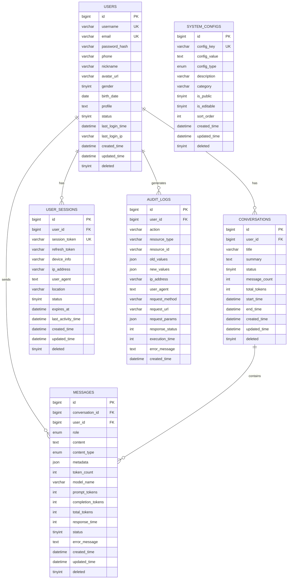

# XLHealth 数据库设计文档

## 1. 文档概述

### 1.1 设计目标

- 为 XLHealth AI 心理咨询系统提供稳定、高效的数据存储方案
- 支持用户认证、AI 对话、历史记录管理等核心业务功能
- 确保数据安全性、完整性和高可用性
- 支持系统横向扩展和性能优化

### 1.2 适用范围

- XLHealth 后端开发团队
- 数据库管理员（DBA）
- 系统运维人员
- 产品和测试团队

### 1.3 读者对象

- **主要读者**：后端开发工程师、数据库设计师
- **次要读者**：项目经理、测试工程师、运维工程师
- **技术要求**：熟悉 MySQL 8.0、SQL 语言、数据库设计原理

### 1.4 技术规范

- **数据库版本**：MySQL 8.0+
- **字符集**：utf8mb4
- **排序规则**：utf8mb4_unicode_ci
- **存储引擎**：InnoDB
- **时区**：Asia/Shanghai

---

## 2. 实体关系图 (ERD)



---

## 3. 数据字典

### 3.1 ⭐ 用户表 (users)

| 字段名        | 类型         | 约束               | 默认值                      | 描述                  | 示例                   |
| ------------- | ------------ | ------------------ | --------------------------- | --------------------- | ---------------------- |
| id            | BIGINT       | PK, AUTO_INCREMENT | -                           | 用户唯一标识          | 1001                   |
| username      | VARCHAR(50)  | UNIQUE, NOT NULL   | -                           | 🔒 用户名（登录用）   | user001                |
| email         | VARCHAR(100) | UNIQUE, NOT NULL   | -                           | 🔒 邮箱地址           | user@example.com       |
| password_hash | VARCHAR(255) | NOT NULL           | -                           | 🔒 密码哈希值(BCrypt) | $2a$10$...             |
| phone         | VARCHAR(20)  | NULL               | NULL                        | 手机号码              | 13800138000            |
| nickname      | VARCHAR(50)  | NOT NULL           | -                           | 用户昵称（显示用）    | 小明                   |
| avatar_url    | VARCHAR(500) | NULL               | NULL                        | 头像 URL              | /avatars/user001.jpg   |
| gender        | TINYINT      | NULL               | NULL                        | 性别: 0-未知, 1-男, 2-女 | 1                   |
| birth_date    | DATE         | NULL               | NULL                        | 出生日期              | 1990-01-01             |
| profile       | TEXT         | NULL               | NULL                        | 个人简介              | 这是我的个人简介       |
| status        | TINYINT      | NOT NULL           | 1                           | 状态: 0-禁用, 1-正常, 2-待验证 | 1                |
| last_login_time | DATETIME   | NULL               | NULL                        | 最后登录时间          | 2024-01-01 10:00:00    |
| last_login_ip | VARCHAR(45)  | NULL               | NULL                        | 最后登录IP            | 192.168.1.100          |
| created_time  | DATETIME     | NOT NULL           | CURRENT_TIMESTAMP           | 创建时间              | 2024-01-01 10:00:00    |
| updated_time  | DATETIME     | NOT NULL           | CURRENT_TIMESTAMP ON UPDATE | 更新时间              | 2024-01-01 10:00:00    |
| deleted       | TINYINT      | NOT NULL           | 0                           | 逻辑删除标记: 0-未删除, 1-已删除 | 0              |

### 3.2 ⭐ 对话表 (conversations)

| 字段名          | 类型         | 约束                | 默认值                      | 描述         | 示例                    |
| --------------- | ------------ | ------------------- | --------------------------- | ------------ | ----------------------- |
| id              | BIGINT       | PK, AUTO_INCREMENT  | -                           | 对话唯一标识 | 2001                    |
| user_id         | BIGINT       | FK, NOT NULL, INDEX | -                           | 用户 ID      | 1001                    |
| title           | VARCHAR(200) | NOT NULL            | -                           | 对话标题     | 关于焦虑的咨询          |
| summary         | TEXT         | NULL                | NULL                        | 对话摘要     | 用户咨询焦虑问题的对话  |
| status          | TINYINT      | NOT NULL            | 1                           | 状态: 0-已删除, 1-进行中, 2-已结束 | 1                    |
| message_count   | INT          | NOT NULL            | 0                           | 消息数量     | 15                      |
| total_tokens    | INT          | NOT NULL            | 0                           | 总token数    | 1500                    |
| start_time      | DATETIME     | NULL                | NULL                        | 开始时间     | 2024-01-01 10:00:00     |
| end_time        | DATETIME     | NULL                | NULL                        | 结束时间     | 2024-01-01 11:00:00     |
| created_time    | DATETIME     | NOT NULL            | CURRENT_TIMESTAMP           | 创建时间     | 2024-01-01 10:00:00     |
| updated_time    | DATETIME     | NOT NULL            | CURRENT_TIMESTAMP ON UPDATE | 更新时间     | 2024-01-01 10:00:00     |
| deleted         | TINYINT      | NOT NULL            | 0                           | 逻辑删除标记: 0-未删除, 1-已删除 | 0              |

### 3.3 ⭐ 消息表 (messages)

| 字段名 | 数据类型 | 约束 | 默认值 | 说明 |
|--------|----------|------|--------|------|
| id | BIGINT | PRIMARY KEY, AUTO_INCREMENT | - | 消息唯一标识 |
| conversation_id | BIGINT | FOREIGN KEY, NOT NULL | - | 对话ID |
| user_id | BIGINT | FOREIGN KEY, NOT NULL | - | 用户ID |
| role | ENUM('user', 'assistant', 'system') | NOT NULL | - | 消息角色 |
| content | TEXT | NOT NULL | - | 消息内容 |
| content_type | ENUM('text', 'image', 'audio', 'video', 'file') | NOT NULL | 'text' | 内容类型 |
| metadata | JSON | - | NULL | 消息元数据 |
| token_count | INT | - | NULL | token数量 |
| model_name | VARCHAR(100) | - | NULL | 使用的模型名称 |
| prompt_tokens | INT | - | NULL | 提示token数 |
| completion_tokens | INT | - | NULL | 完成token数 |
| total_tokens | INT | - | NULL | 总token数 |
| response_time | INT | - | NULL | 响应时间(毫秒) |
| status | TINYINT | NOT NULL | 1 | 状态: 0-失败, 1-成功, 2-处理中 |
| error_message | TEXT | - | NULL | 错误信息 |
| created_time | DATETIME | NOT NULL | CURRENT_TIMESTAMP | 创建时间 |
| updated_time | DATETIME | NOT NULL | CURRENT_TIMESTAMP ON UPDATE CURRENT_TIMESTAMP | 更新时间 |
| deleted | TINYINT | NOT NULL | 0 | 逻辑删除标记: 0-未删除, 1-已删除 |

### 3.4 用户会话表 (user_sessions)

| 字段名 | 数据类型 | 约束 | 默认值 | 说明 |
|--------|----------|------|--------|------|
| id | BIGINT | PRIMARY KEY, AUTO_INCREMENT | - | 会话唯一标识 |
| user_id | BIGINT | FOREIGN KEY, NOT NULL | - | 用户ID |
| session_token | VARCHAR(255) | UNIQUE, NOT NULL | - | 会话令牌 |
| refresh_token | VARCHAR(255) | - | NULL | 刷新令牌 |
| device_info | VARCHAR(500) | - | NULL | 设备信息 |
| ip_address | VARCHAR(45) | NOT NULL | - | IP地址 |
| user_agent | TEXT | - | NULL | 用户代理 |
| location | VARCHAR(200) | - | NULL | 地理位置 |
| status | TINYINT | NOT NULL | 1 | 状态: 0-已失效, 1-活跃, 2-已过期 |
| expires_at | DATETIME | NOT NULL | - | 过期时间 |
| last_activity_time | DATETIME | NOT NULL | CURRENT_TIMESTAMP | 最后活动时间 |
| created_time | DATETIME | NOT NULL | CURRENT_TIMESTAMP | 创建时间 |
| updated_time | DATETIME | NOT NULL | CURRENT_TIMESTAMP ON UPDATE CURRENT_TIMESTAMP | 更新时间 |
| deleted | TINYINT | NOT NULL | 0 | 逻辑删除标记: 0-未删除, 1-已删除 |

### 3.5 系统配置表 (system_configs)

| 字段名 | 数据类型 | 约束 | 默认值 | 说明 |
|--------|----------|------|--------|------|
| id | BIGINT | PRIMARY KEY, AUTO_INCREMENT | - | 配置唯一标识 |
| config_key | VARCHAR(100) | UNIQUE, NOT NULL | - | 配置键 |
| config_value | TEXT | NOT NULL | - | 配置值 |
| config_type | ENUM('STRING', 'NUMBER', 'BOOLEAN', 'JSON') | NOT NULL | 'STRING' | 配置类型 |
| description | VARCHAR(500) | - | NULL | 配置描述 |
| category | VARCHAR(50) | - | NULL | 配置分类 |
| is_public | TINYINT | NOT NULL | 0 | 是否公开: 0-私有, 1-公开 |
| is_editable | TINYINT | NOT NULL | 1 | 是否可编辑: 0-不可编辑, 1-可编辑 |
| sort_order | INT | NOT NULL | 0 | 排序顺序 |
| created_time | DATETIME | NOT NULL | CURRENT_TIMESTAMP | 创建时间 |
| updated_time | DATETIME | NOT NULL | CURRENT_TIMESTAMP ON UPDATE CURRENT_TIMESTAMP | 更新时间 |
| deleted | TINYINT | NOT NULL | 0 | 逻辑删除标记: 0-未删除, 1-已删除 |

### 3.6 审计日志表 (audit_logs)

| 字段名 | 数据类型 | 约束 | 默认值 | 说明 |
|--------|----------|------|--------|------|
| id | BIGINT | PRIMARY KEY, AUTO_INCREMENT | - | 日志唯一标识 |
| user_id | BIGINT | FOREIGN KEY | - | 用户ID |
| action | VARCHAR(100) | NOT NULL | - | 操作类型 |
| resource_type | VARCHAR(50) | NOT NULL | - | 资源类型 |
| resource_id | VARCHAR(100) | - | NULL | 资源ID |
| old_values | JSON | - | NULL | 修改前的值 |
| new_values | JSON | - | NULL | 修改后的值 |
| ip_address | VARCHAR(45) | NOT NULL | - | IP地址 |
| user_agent | TEXT | - | NULL | 用户代理 |
| request_method | VARCHAR(10) | - | NULL | 请求方法 |
| request_url | VARCHAR(500) | - | NULL | 请求URL |
| request_params | JSON | - | NULL | 请求参数 |
| response_status | INT | - | NULL | 响应状态码 |
| execution_time | INT | - | NULL | 执行时间(毫秒) |
| error_message | TEXT | - | NULL | 错误信息 |
| created_time | DATETIME | NOT NULL | CURRENT_TIMESTAMP | 创建时间 |

---

## 4. 索引设计

### 4.1 主键索引 (自动创建)

- `users.id`
- `conversations.id`
- `messages.id`
- `audit_logs.id`
- `system_configs.id`
- `user_sessions.id`

### 4.2 唯一索引

```sql
-- 用户表唯一索引
CREATE UNIQUE INDEX uk_users_username ON users(username);
CREATE UNIQUE INDEX uk_users_email ON users(email);

-- 会话表唯一索引
CREATE UNIQUE INDEX uk_user_sessions_session_token ON user_sessions(session_token);

-- 系统配置表唯一索引
CREATE UNIQUE INDEX uk_system_configs_config_key ON system_configs(config_key);
```

### 4.3 业务索引

```sql
-- 对话表索引
CREATE INDEX idx_conversations_user_id ON conversations(user_id);
CREATE INDEX idx_conversations_status ON conversations(status);
CREATE INDEX idx_conversations_created_time ON conversations(created_time);
CREATE INDEX idx_conversations_deleted ON conversations(deleted);

-- 消息表索引
CREATE INDEX idx_messages_conversation_id ON messages(conversation_id);
CREATE INDEX idx_messages_user_id ON messages(user_id);
CREATE INDEX idx_messages_created_time ON messages(created_time);
CREATE INDEX idx_messages_role ON messages(role);
CREATE INDEX idx_messages_status ON messages(status);
CREATE INDEX idx_messages_deleted ON messages(deleted);
CREATE INDEX idx_messages_conversation_created ON messages(conversation_id, created_time);

-- 会话表索引
CREATE INDEX idx_sessions_user_id ON user_sessions(user_id);
CREATE INDEX idx_sessions_expires_at ON user_sessions(expires_at);
CREATE INDEX idx_sessions_status ON user_sessions(status);
CREATE INDEX idx_sessions_deleted ON user_sessions(deleted);

-- 系统配置表索引
CREATE INDEX idx_system_configs_category ON system_configs(category);
CREATE INDEX idx_system_configs_deleted ON system_configs(deleted);

-- 审计日志索引
CREATE INDEX idx_audit_user_id ON audit_logs(user_id);
CREATE INDEX idx_audit_resource ON audit_logs(resource_type, resource_id);
CREATE INDEX idx_audit_created_time ON audit_logs(created_time);
CREATE INDEX idx_audit_action ON audit_logs(action);
```

### 4.4 索引创建原因

| 索引名                            | 创建原因         | 查询场景                 |
| --------------------------------- | ---------------- | ------------------------ |
| idx_conversations_user_id         | 用户对话列表查询 | 获取用户所有对话         |
| idx_messages_conversation_id      | 对话消息查询     | 加载对话历史消息         |
| idx_messages_conversation_created | 复合索引优化     | 按对话 ID 和时间排序查询 |
| idx_sessions_expires_at           | 会话清理         | 定期清理过期会话         |
| idx_audit_created_at              | 日志查询         | 按时间范围查询操作日志   |

---

## 5. 性能优化

### 5.1 分表策略

#### 5.1.1 消息表分表 (messages)

```sql
-- 按月分表策略
CREATE TABLE messages_202401 LIKE messages;
CREATE TABLE messages_202402 LIKE messages;
-- ... 继续创建月表

-- 分表路由规则
-- 根据 created_time 字段按月路由到对应分表
SELECT * FROM messages_202401 
WHERE conversation_id = ? 
AND created_time >= '2024-01-01' 
AND created_time < '2024-02-01';
```

#### 5.1.2 审计日志分表 (audit_logs)

```sql
-- 按季度分表策略
CREATE TABLE audit_logs_2024q1 LIKE audit_logs;
CREATE TABLE audit_logs_2024q2 LIKE audit_logs;
-- ... 继续创建季度表

-- 历史数据归档
INSERT INTO audit_logs_archive 
SELECT * FROM audit_logs_2023q4 
WHERE created_time < '2024-01-01';
```

### 5.2 读写分离方案

#### 5.2.1 主从架构

- **主库 (Master)**：处理所有写操作 (INSERT, UPDATE, DELETE)
- **从库 (Slave)**：处理读操作 (SELECT)
- **同步方式**：MySQL 主从复制 (binlog)

#### 5.2.2 读写路由策略

```yaml
# 应用层配置
datasource:
  master:
    url: jdbc:mysql://master-db:3306/xlhealth
    operations: [INSERT, UPDATE, DELETE]
  slave:
    url: jdbc:mysql://slave-db:3306/xlhealth
    operations: [SELECT]
```

### 5.3 缓存机制

#### 5.3.1 Redis 缓存策略

```yaml
# 缓存配置
cache:
  user_info:
    key_pattern: "user:info:{user_id}"
    ttl: 3600 # 1小时

  conversation_list:
    key_pattern: "user:conversations:{user_id}"
    ttl: 1800 # 30分钟

  system_config:
    key_pattern: "system:config:{config_key}"
    ttl: 86400 # 24小时
```

#### 缓存示例

```sql
-- 用户信息缓存 (Redis)
KEY: user:{user_id}
VALUE: {"id":1,"username":"john","email":"john@example.com","status":1,"nickname":"John"}
TTL: 3600

-- 对话列表缓存
KEY: conversations:{user_id}
VALUE: [{"id":1,"title":"对话1","created_time":"2024-01-01","message_count":5},...]
TTL: 1800

-- 系统配置缓存
KEY: config:{config_key}
VALUE: config_value
TTL: 86400

-- 用户会话缓存
KEY: session:{session_token}
VALUE: {"user_id":1,"expires_at":"2024-01-02","status":1}
TTL: 86400
```

#### 5.3.2 缓存更新策略

- **用户信息**：写入时更新缓存 (Write-Through)
- **对话列表**：定时刷新 + 手动失效
- **系统配置**：手动更新时清除缓存

### 5.4 查询优化

#### 5.4.1 分页查询优化

```sql
-- 避免 OFFSET 大数值的性能问题
-- 使用游标分页
SELECT * FROM conversations
WHERE user_id = ? AND id < ?
ORDER BY id DESC
LIMIT 20;

-- 常用查询模式
-- 1. 用户对话列表查询
SELECT c.id, c.title, c.status, c.created_time, c.updated_time,
       c.message_count, c.total_tokens
FROM conversations c
WHERE c.user_id = ? AND c.deleted = 0
ORDER BY c.updated_time DESC
LIMIT 20;

-- 2. 对话消息历史查询
SELECT id, role, content, content_type, created_time, token_count
FROM messages
WHERE conversation_id = ? AND deleted = 0
ORDER BY created_time ASC;

-- 3. 用户活跃度统计
SELECT DATE(created_time) as date, COUNT(*) as message_count,
       SUM(token_count) as total_tokens
FROM messages
WHERE user_id = ? 
AND created_time >= DATE_SUB(NOW(), INTERVAL 30 DAY)
AND deleted = 0
GROUP BY DATE(created_time)
ORDER BY date DESC;
```

#### 5.4.2 统计查询优化

```sql
-- 使用汇总表存储统计数据
CREATE TABLE user_statistics (
    user_id BIGINT PRIMARY KEY,
    total_conversations INT DEFAULT 0,
    total_messages INT DEFAULT 0,
    last_active_at TIMESTAMP,
    updated_at TIMESTAMP DEFAULT CURRENT_TIMESTAMP ON UPDATE CURRENT_TIMESTAMP
);
```

---

## 6. 变更记录

### 版本 1.0.0 (2024-01-01)

**初始版本**

### 版本 1.1.0 (2024-12-19)

**重大更新**：根据实际init.sql脚本修正文档，包括：
- 时间字段统一为`_time`后缀
- `status`字段类型改为`TINYINT`
- 新增多个业务字段（phone、gender、profile等）
- 表名修正（system_config → system_configs）
- 新增逻辑删除字段`deleted`
- 完善索引设计和性能优化策略

```sql
-- XLHealth AI 心理咨询系统数据库初始化脚本
-- 创建时间: 2024-01-01
-- 版本: 1.0.0

-- 创建数据库
CREATE DATABASE IF NOT EXISTS xlhealth CHARACTER SET utf8mb4 COLLATE utf8mb4_unicode_ci;
USE xlhealth;

-- 1. 用户表 (users)
CREATE TABLE users (
    id BIGINT AUTO_INCREMENT PRIMARY KEY COMMENT '用户ID',
    username VARCHAR(50) NOT NULL UNIQUE COMMENT '用户名',
    email VARCHAR(100) NOT NULL UNIQUE COMMENT '邮箱',
    password_hash VARCHAR(255) NOT NULL COMMENT '密码哈希',
    phone VARCHAR(20) COMMENT '手机号',
    nickname VARCHAR(50) COMMENT '昵称',
    avatar_url VARCHAR(500) COMMENT '头像URL',
    gender TINYINT DEFAULT 0 COMMENT '性别: 0-未知, 1-男, 2-女',
    birth_date DATE COMMENT '出生日期',
    profile TEXT COMMENT '个人简介',
    status TINYINT DEFAULT 1 COMMENT '状态: 0-禁用, 1-正常, 2-待验证',
    last_login_time DATETIME COMMENT '最后登录时间',
    last_login_ip VARCHAR(45) COMMENT '最后登录IP',
    created_time DATETIME DEFAULT CURRENT_TIMESTAMP COMMENT '创建时间',
    updated_time DATETIME DEFAULT CURRENT_TIMESTAMP ON UPDATE CURRENT_TIMESTAMP COMMENT '更新时间',
    deleted TINYINT DEFAULT 0 COMMENT '逻辑删除: 0-未删除, 1-已删除',
    INDEX idx_username (username),
    INDEX idx_email (email),
    INDEX idx_phone (phone),
    INDEX idx_status (status),
    INDEX idx_created_time (created_time)
) ENGINE=InnoDB DEFAULT CHARSET=utf8mb4 COLLATE=utf8mb4_unicode_ci COMMENT='用户表';

-- 2. 对话表 (conversations)
CREATE TABLE conversations (
    id BIGINT AUTO_INCREMENT PRIMARY KEY COMMENT '对话ID',
    user_id BIGINT NOT NULL COMMENT '用户ID',
    title VARCHAR(200) DEFAULT '新对话' COMMENT '对话标题',
    summary TEXT COMMENT '对话摘要',
    status TINYINT DEFAULT 1 COMMENT '状态: 0-已结束, 1-进行中, 2-已暂停',
    message_count INT DEFAULT 0 COMMENT '消息数量',
    total_tokens INT DEFAULT 0 COMMENT '总token数',
    start_time DATETIME DEFAULT CURRENT_TIMESTAMP COMMENT '开始时间',
    end_time DATETIME COMMENT '结束时间',
    created_time DATETIME DEFAULT CURRENT_TIMESTAMP COMMENT '创建时间',
    updated_time DATETIME DEFAULT CURRENT_TIMESTAMP ON UPDATE CURRENT_TIMESTAMP COMMENT '更新时间',
    deleted TINYINT DEFAULT 0 COMMENT '逻辑删除: 0-未删除, 1-已删除',
    FOREIGN KEY (user_id) REFERENCES users(id) ON DELETE CASCADE,
    INDEX idx_user_id (user_id),
    INDEX idx_status (status),
    INDEX idx_created_time (created_time),
    INDEX idx_start_time (start_time)
) ENGINE=InnoDB DEFAULT CHARSET=utf8mb4 COLLATE=utf8mb4_unicode_ci COMMENT='对话表';

-- 3. 消息表 (messages)
CREATE TABLE messages (
    id BIGINT AUTO_INCREMENT PRIMARY KEY COMMENT '消息ID',
    conversation_id BIGINT NOT NULL COMMENT '对话ID',
    user_id BIGINT NOT NULL COMMENT '用户ID',
    role ENUM('user', 'assistant', 'system') NOT NULL COMMENT '角色类型',
    content TEXT NOT NULL COMMENT '消息内容',
    content_type ENUM('text', 'image', 'audio', 'file') DEFAULT 'text' COMMENT '内容类型',
    metadata JSON COMMENT '元数据(JSON格式)',
    token_count INT DEFAULT 0 COMMENT 'token数量',
    model_name VARCHAR(100) COMMENT '使用的模型名称',
    prompt_tokens INT DEFAULT 0 COMMENT '提示token数',
    completion_tokens INT DEFAULT 0 COMMENT '完成token数',
    total_tokens INT DEFAULT 0 COMMENT '总token数',
    response_time INT DEFAULT 0 COMMENT '响应时间(毫秒)',
    status TINYINT DEFAULT 1 COMMENT '状态: 0-失败, 1-成功, 2-处理中',
    error_message TEXT COMMENT '错误信息',
    created_time DATETIME DEFAULT CURRENT_TIMESTAMP COMMENT '创建时间',
    updated_time DATETIME DEFAULT CURRENT_TIMESTAMP ON UPDATE CURRENT_TIMESTAMP COMMENT '更新时间',
    deleted TINYINT DEFAULT 0 COMMENT '逻辑删除: 0-未删除, 1-已删除',
    FOREIGN KEY (conversation_id) REFERENCES conversations(id) ON DELETE CASCADE,
    FOREIGN KEY (user_id) REFERENCES users(id) ON DELETE CASCADE,
    INDEX idx_conversation_id (conversation_id),
    INDEX idx_user_id (user_id),
    INDEX idx_role (role),
    INDEX idx_created_time (created_time),
    INDEX idx_status (status)
) ENGINE=InnoDB DEFAULT CHARSET=utf8mb4 COLLATE=utf8mb4_unicode_ci COMMENT='消息表';

-- 4. 用户会话表 (user_sessions)
CREATE TABLE user_sessions (
    id BIGINT AUTO_INCREMENT PRIMARY KEY COMMENT '会话ID',
    user_id BIGINT NOT NULL COMMENT '用户ID',
    session_token VARCHAR(255) NOT NULL UNIQUE COMMENT '会话令牌',
    refresh_token VARCHAR(255) COMMENT '刷新令牌',
    device_info VARCHAR(500) COMMENT '设备信息',
    ip_address VARCHAR(45) COMMENT 'IP地址',
    user_agent TEXT COMMENT '用户代理',
    location VARCHAR(200) COMMENT '地理位置',
    status TINYINT DEFAULT 1 COMMENT '状态: 0-已失效, 1-有效',
    expires_at DATETIME NOT NULL COMMENT '过期时间',
    last_activity_time DATETIME DEFAULT CURRENT_TIMESTAMP COMMENT '最后活动时间',
    created_time DATETIME DEFAULT CURRENT_TIMESTAMP COMMENT '创建时间',
    updated_time DATETIME DEFAULT CURRENT_TIMESTAMP ON UPDATE CURRENT_TIMESTAMP COMMENT '更新时间',
    deleted TINYINT DEFAULT 0 COMMENT '逻辑删除: 0-未删除, 1-已删除',
    FOREIGN KEY (user_id) REFERENCES users(id) ON DELETE CASCADE,
    INDEX idx_user_id (user_id),
    INDEX idx_session_token (session_token),
    INDEX idx_status (status),
    INDEX idx_expires_at (expires_at),
    INDEX idx_last_activity_time (last_activity_time)
) ENGINE=InnoDB DEFAULT CHARSET=utf8mb4 COLLATE=utf8mb4_unicode_ci COMMENT='用户会话表';

-- 5. 系统配置表 (system_configs)
CREATE TABLE system_configs (
    id BIGINT AUTO_INCREMENT PRIMARY KEY COMMENT '配置ID',
    config_key VARCHAR(100) NOT NULL UNIQUE COMMENT '配置键',
    config_value TEXT COMMENT '配置值',
    config_type ENUM('string', 'number', 'boolean', 'json') DEFAULT 'string' COMMENT '配置类型',
    description VARCHAR(500) COMMENT '配置描述',
    category VARCHAR(50) DEFAULT 'general' COMMENT '配置分类',
    is_public TINYINT DEFAULT 0 COMMENT '是否公开: 0-私有, 1-公开',
    is_editable TINYINT DEFAULT 1 COMMENT '是否可编辑: 0-不可编辑, 1-可编辑',
    sort_order INT DEFAULT 0 COMMENT '排序顺序',
    created_time DATETIME DEFAULT CURRENT_TIMESTAMP COMMENT '创建时间',
    updated_time DATETIME DEFAULT CURRENT_TIMESTAMP ON UPDATE CURRENT_TIMESTAMP COMMENT '更新时间',
    deleted TINYINT DEFAULT 0 COMMENT '逻辑删除: 0-未删除, 1-已删除',
    INDEX idx_config_key (config_key),
    INDEX idx_category (category),
    INDEX idx_is_public (is_public),
    INDEX idx_sort_order (sort_order)
) ENGINE=InnoDB DEFAULT CHARSET=utf8mb4 COLLATE=utf8mb4_unicode_ci COMMENT='系统配置表';

-- 6. 审计日志表 (audit_logs)
CREATE TABLE audit_logs (
    id BIGINT AUTO_INCREMENT PRIMARY KEY COMMENT '日志ID',
    user_id BIGINT COMMENT '用户ID',
    action VARCHAR(100) NOT NULL COMMENT '操作动作',
    resource_type VARCHAR(50) COMMENT '资源类型',
    resource_id VARCHAR(100) COMMENT '资源ID',
    old_values JSON COMMENT '旧值(JSON格式)',
    new_values JSON COMMENT '新值(JSON格式)',
    ip_address VARCHAR(45) COMMENT 'IP地址',
    user_agent TEXT COMMENT '用户代理',
    request_method VARCHAR(10) COMMENT '请求方法',
    request_url VARCHAR(500) COMMENT '请求URL',
    request_params JSON COMMENT '请求参数(JSON格式)',
    response_status INT COMMENT '响应状态码',
    execution_time INT COMMENT '执行时间(毫秒)',
    error_message TEXT COMMENT '错误信息',
    created_time DATETIME DEFAULT CURRENT_TIMESTAMP COMMENT '创建时间',
    FOREIGN KEY (user_id) REFERENCES users(id) ON DELETE SET NULL,
    INDEX idx_user_id (user_id),
    INDEX idx_action (action),
    INDEX idx_resource_type (resource_type),
    INDEX idx_resource_id (resource_id),
    INDEX idx_created_time (created_time),
    INDEX idx_ip_address (ip_address)
) ENGINE=InnoDB DEFAULT CHARSET=utf8mb4 COLLATE=utf8mb4_unicode_ci COMMENT='审计日志表';

-- 插入初始系统配置数据
INSERT INTO system_configs (config_key, config_value, config_type, description, category, is_public) VALUES
('system.name', 'XLHealth AI 心理咨询系统', 'string', '系统名称', 'system', 1),
('system.version', '1.0.0', 'string', '系统版本', 'system', 1),
('system.description', 'AI驱动的心理健康咨询平台', 'string', '系统描述', 'system', 1),
('ai.model.default', 'gpt-3.5-turbo', 'string', '默认AI模型', 'ai', 0),
('ai.max_tokens', '4000', 'number', '最大token数', 'ai', 0),
('ai.temperature', '0.7', 'number', 'AI温度参数', 'ai', 0),
('session.timeout', '86400', 'number', '会话超时时间(秒)', 'security', 0),
('upload.max_file_size', '10485760', 'number', '最大文件上传大小(字节)', 'upload', 0),
('upload.allowed_types', '["jpg","jpeg","png","gif","pdf","doc","docx"]', 'json', '允许上传的文件类型', 'upload', 0),
('notification.email.enabled', 'true', 'boolean', '是否启用邮件通知', 'notification', 0);

-- 创建管理员用户 (密码: admin123)
INSERT INTO users (username, email, password_hash, nickname, status) VALUES
('admin', 'admin@xlhealth.com', '$2a$10$N.zmdr9k7uOCQb376NoUnuTJ8iAt6Z5EHsM8lE9lBaYMountjdMSS', '系统管理员', 1);
```

### 版本 1.1.0 (计划中)

**功能增强**

- 添加用户标签系统
- 增加消息情感分析字段
- 优化索引结构

### 版本 1.2.0 (计划中)

**性能优化**

- 实施消息表分表策略
- 添加缓存层支持
- 实现读写分离

---

## 7. 附录

### 7.1 数据库连接配置

```yaml
# application.yml
spring:
  datasource:
    url: jdbc:mysql://localhost:3306/xlhealth?characterEncoding=utf-8&serverTimezone=Asia/Shanghai&useSSL=false
    username: ${DB_USERNAME:xlhealth}
    password: ${DB_PASSWORD:password}
    driver-class-name: com.mysql.cj.jdbc.Driver

  jpa:
    hibernate:
      ddl-auto: validate
    show-sql: false
    properties:
      hibernate:
        dialect: org.hibernate.dialect.MySQL8Dialect
        format_sql: true
```

### 7.2 安全注意事项

- 🔒 敏感字段需要在应用层加密存储
- 定期备份数据库，保留至少 30 天的备份
- 启用 MySQL 慢查询日志，监控性能
- 配置数据库防火墙，限制访问 IP
- 定期更新数据库版本，修复安全漏洞

### 7.3 监控指标

- 数据库连接数
- 查询响应时间
- 慢查询数量
- 磁盘使用率
- 主从同步延迟

---

**文档版本**：v1.0  
**创建日期**：2024-01-01  
**最后更新**：2024-01-01  
**维护人员**：XLHealth 开发团队
